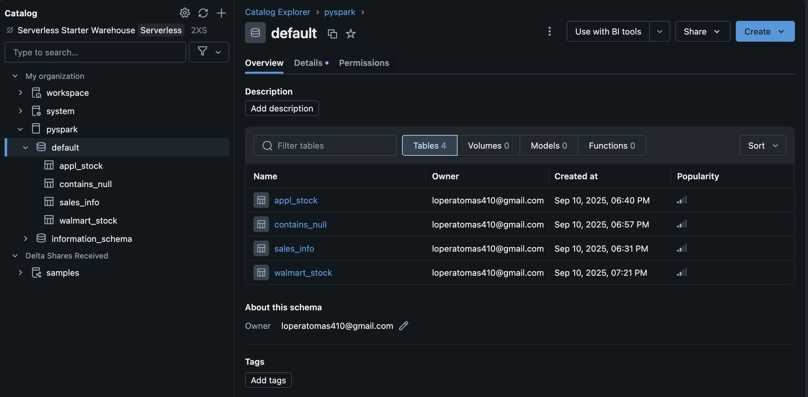

# Curso de PySpark

Este repositorio contiene el material y ejemplos desarrollados para el **Curso de PySpark**, enfocado en el uso de **pyspark.sql** y **pyspark.ml** para el procesamiento y análisis de datos a gran escala.  

El proyecto combina trabajo práctico en **Databricks** y **Visual Studio Code**, mostrando cómo abordar todo el ciclo de trabajo con Spark: **Ingesta de datos, preparación, modelado y evaluación de modelos de Machine Learning**.  

---

## Contenido del curso

### 1. Ingesta y manipulación de datos (Databricks)
- Uso de `pyspark.sql` para la carga de datos desde diferentes fuentes.  
- Transformaciones y operaciones sobre DataFrames.  
- Limpieza y preparación de datos.  
- Ejemplos de consultas SQL sobre Spark.  

### 2. Preparación y exploración de datos
- Manejo de valores nulos y duplicados.  
- Conversión de tipos de datos.  
- Creación de variables derivadas.  
- Normalización y escalamiento.  

### 3. Machine Learning con PySpark (VS Code)
Implementación de modelos con **pyspark.ml** en cuatro áreas:  

- **Agrupamiento (Clustering)**  
  - KMeans: identificación de centroides y distribución de clusters.  

- **Clasificación**  
  - Regresión logística.  
  - Árboles de decisión.  
  - Random Forest.  

- **Regresión**  
  - Regresión lineal.  

- **Recomendación**  
  - ALS (Alternating Least Squares) para sistemas de recomendación.  

Cada modelo incluye:  
- Pipeline de preparación de datos.  
- Evaluación con métricas como **accuracy**, **F1-score**, **RMSE**, **MAE** según el caso.  

---

## 🛠️ Tecnologías utilizadas
- **Python 3.x**  
- **PySpark** (`pyspark.sql`, `pyspark.ml`)  
- **Databricks** (para ingesta y manipulación de datos)  
- **Visual Studio Code** (para ML con `pyspark.ml`)
